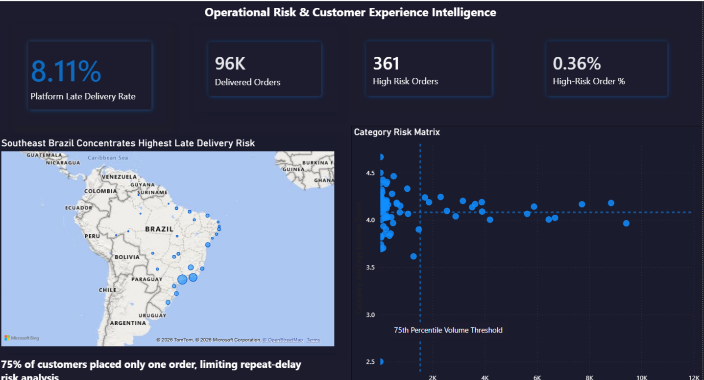
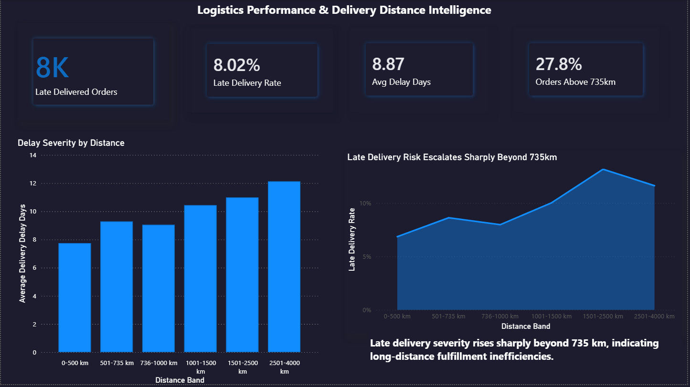
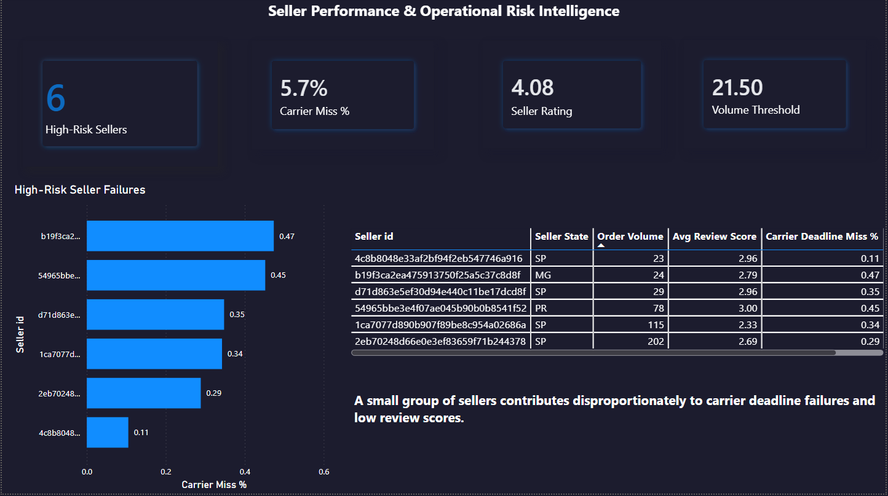
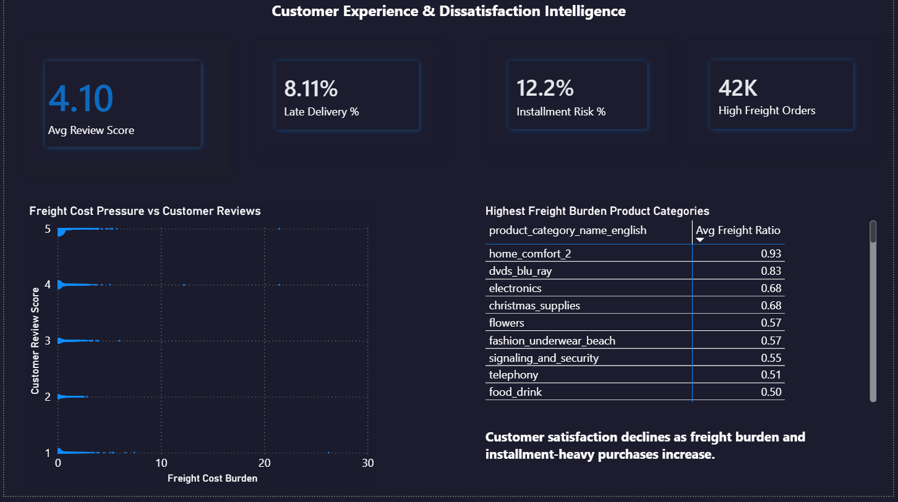
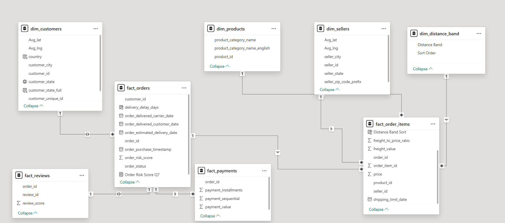

# Olist E-Commerce Operations Intelligence Dashboard

A multi-page operational intelligence dashboard built on the Olist Brazilian e-commerce dataset to monitor delivery risk, logistics efficiency, seller performance, and customer dissatisfaction across 100,000+ orders.

---

## Dashboard Preview

### Page 1 — Head of Operations


### Page 2 — Logistics Team


### Page 3 — Seller Management


### Page 4 — Customer Experience


---

## Business Problem

Olist operates across 27 Brazilian states with thousands of sellers and over 100,000 orders. Operations leadership needed a way to identify:

- Which regions carry the highest late delivery risk
- Which sellers are creating logistics failures
- Which product categories are damaging customer experience
- How delivery distance affects operational performance
- Where composite operational risk signals are concentrating

---

## Key Findings

| Finding | Metric |
|---------|--------|
| Platform late delivery rate | 8.11% across 96K delivered orders |
| Highest regional risk | Rio de Janeiro at 13% late delivery rate |
| Distance threshold | Late delivery risk escalates sharply beyond 735km |
| Long-distance exposure | 27.8% of orders exceed the 735km risk threshold |
| High-risk sellers identified | 6 sellers flagged for disproportionate carrier deadline failures |
| Composite risk orders | 361 orders carry 3+ simultaneous dissatisfaction signals |
| Repeat customer risk | Limited — 75% of customers placed only 1 order |

---

## Dashboard Structure

The dashboard is structured across 4 pages, each designed for a specific operational audience.

### Page 1 — Head of Operations

Regional delivery risk map, category risk matrix, and composite operational risk KPIs for executive-level monitoring.

### Page 2 — Logistics Team

Distance band analysis showing late delivery rate and delay severity escalation beyond 735km, with supporting logistics exposure KPIs.

### Page 3 — Seller Management

High-risk sellers identified using a dual-threshold model combining operational volume and customer review deterioration. Carrier deadline miss rates surfaced at seller level.

### Page 4 — Customer Experience

Freight burden analysis, installment exposure risk, and category-level dissatisfaction indicators for customer retention monitoring.

---

## Data Model Architecture



---

## Technical Architecture

### Data Source

[Olist Brazilian E-Commerce Dataset](https://www.kaggle.com/datasets/olistbr/brazilian-ecommerce)

Dataset includes:

- 9 relational tables
- 100,000+ orders
- Seller, customer, payment, review, product, and geolocation data

---

### Data Engineering — MySQL

Key preprocessing and transformation tasks performed in MySQL:

- Converted date columns from VARCHAR to DATETIME
- Built a star schema architecture
- Validated null values, duplicates, and referential integrity
- Engineered delivery and operational performance metrics

Derived metrics created:

| Derived Metric | Description |
|---|---|
| `delivery_delay_days` | Difference between estimated and actual delivery |
| `carrier_deadline_miss_days` | Seller logistics accountability metric |
| `freight_to_price_ratio` | Shipping burden dissatisfaction proxy |
| `delivery_distance_km` | Seller-to-customer distance using Haversine formula |
| `order_risk_score` | Composite dissatisfaction scoring model |

---

### Data Modeling — Power BI

- Star schema with validated relationships and cardinality
- Centralized measure table for KPI management
- Calculated columns for operational segmentation
- Relationship filter propagation validated to avoid ambiguous aggregation behavior across visuals

Fact tables:

- `fact_orders`
- `fact_order_items`
- `fact_reviews`
- `fact_payments`

Dimension tables:

- `dim_customers`
- `dim_products`
- `dim_sellers`
- `dim_distance_band`

---

### KPI Engineering — DAX

| DAX Concept | Application |
|---|---|
| `CALCULATE` + `FILTER` | Conditional operational KPIs |
| `PERCENTILEX.INC` | Seller volume threshold detection |
| `SUMMARIZE` + `AVERAGEX` | Grain-level aggregation |
| `DIVIDE` | Safe ratio calculations |
| `SWITCH` | Distance band classification |
| `ALL` | Platform benchmark overrides |
| `VAR` | Composite risk scoring |
| `SUMX` | Row-level risk iteration |

---

### Analytical Modeling Concepts

- Operational grain engineering
- Benchmark-based threshold detection
- Composite dissatisfaction scoring
- Distance-risk escalation modeling
- Freight burden analysis
- Seller operational accountability tracking
- Distribution-aware KPI design
- Filter context validation across visuals

---

## Data Limitations

| Limitation | Impact |
|---|---|
| 75% of customers placed only 1 order | Repeat customer risk analysis statistically limited |
| Product returns unavailable | Cancellation rate used as dissatisfaction proxy |
| Reviews exist at order level | Product-category sentiment propagated indirectly |

---

## Repository Structure

```text
olist-ecommerce-dashboard/
│
├── README.md
├── Olist_Dashboard.pbix
│
├── architecture/
│   └── data_model_architecture.png
│
├── dax/
│   └── dax_measures.md
│
├── screenshots/
│   ├── page1_operations.png
│   ├── page2_logistics.png
│   ├── page3_seller.png
│   └── page4_customer.png
│
└── sql/
    └── data_preparation.sql
```

---

## Tech Stack

| Tool | Purpose |
|---|---|
| MySQL | Data cleaning, transformation, and metric engineering |
| Power BI Desktop | Data modeling and dashboard development |
| DAX | KPI calculation and analytical modeling |
| Haversine Formula | Geospatial distance calculation |

---

## Live Interactive Dashboard

[View Interactive Dashboard on NovyPro](PASTE_NOVYPRO_LINK_HERE)

---

## Author

**Roshan Vishwakarma**  
Final Year B.E. Information Technology — PVG's College of Engineering, Nashik

GitHub:  
https://github.com/Roshan-1510
